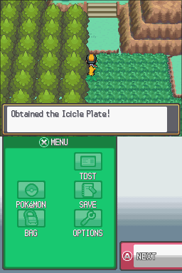
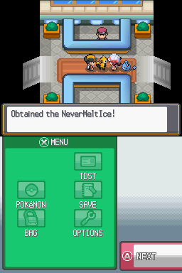

# Early Embernewt items and local artwork

The starter-trio edition now makes both ice-branch items obtainable in ordinary
play, without editing a save.

- **Icicle Plate:** visible one-time item ball at Route 46 world tile **(612,358)**,
  the northwest corner of the southern grass patch, directly below the western
  stairs. The tile's encounter attribute and raised grass mesh are removed,
  revealing the existing ground. A full Bag leaves the ball available.
- **NeverMeltIce:** Ethan/Lyra gives one immediately after the Vs. Recorder in the
  Route 31–Violet gatehouse. If the Bag is full, the attendant keeps the gift.
  Saves that already completed the Vs. Recorder event can also claim it from
  that attendant. The attendant stops offering it after collection.

The evolution rules remain unchanged. These events add no automatic evolution,
move substitution, or inventory changes outside the scripted gifts.

## Implementation

Route 46 event object 7 invokes local script entry 3. The friend event invokes a
shared gift subroutine; the gate attendant invokes the same routine as needed.
Unused persistent flags `0x8FE` and `0x8FF` record the two collections. They are
outside the current trainer range (`0x550` through `0x550+740`), outside daily
flags, and had no symbolic or literal references before this change. No save
block layout or editor profile changes are required.

`tools/py_scripts/patch_route46_icicle_tile.py` regenerates the map edit from
commit `227b8d954`: only land archive member 114 changes. It clears local grid
tile (4,6) and clips four flat grass display lists, including the decorative
north/west fringe. Ground textures, other maps, buildings and collision-height
geometry are preserved. The clipping exposes the original ground surface.

`tools/py_scripts/warm_electric_icons.py` regenerates the Voltuff, Surguenon and
Raijinque menu icons from the same pre-edit commit. HGSS uses shared icon
palettes, so these icons mix existing yellow and orange pixels instead of
changing a palette that would recolor retail Pokémon. The 7:5 orange/yellow
blend averages RGB555 **(30,23,5)**, close to the approved battle gold
**(30,23,4)**. This is a perceptual approximation at icon scale, not an additional
hardware palette. Both icon frames, their silhouettes and palette assignments
are preserved. Approved battle and follower graphics are unchanged.

PKMDS's `fakemon-stock` branch separately bundles all eleven approved battle
portraits and their shiny variants. All three sprite settings use the local
overrides, while retail species retain their existing sources. See its
`FAKEMON_STOCK.md` for regeneration and startup details.

## Validation

- Both HeartGold and SoulSilver starter-trio ROMs build successfully.
- `test_secret_items.py --rom <ROM>` passes **80 compiled event paths per ROM**:
  successful and full-Bag pickups, retries, no duplicate gifts, both genders,
  all three gate rows, follower presence/absence, and older-save recovery. It
  also verifies packaged scripts, dialogue, event data and the modified map.
- `validate_fakemon_assets.py --rom <ROM>` passes **413 checks per ROM**.
- HeartGold DeSmuME testing walked from the southern gate to the Route 46 ball,
  obtained the plate, and confirmed the ball disappeared. A separate run
  triggered Lyra's event and displayed both item gifts. Save/reload results are
  recorded in `validation.json`.
- Test fixtures copy a genuine first-rival-completed save, changing only test
  location, friend-event progress/gender and the two new item flags. A normal
  gate transition refreshes cached map objects before testing. User saves were
  not edited. SoulSilver, Ethan, full-Bag and duplicate paths were verified with
  compiled-script tests; they were not separately played through in the emulator.
- PKMDS Debug Web and Tests builds passed without warnings, and GitHub CI passed.
  Browser verification loaded all 22 local image variants plus an unchanged
  retail Pikachu image. The images use the game's approved pixel art rather
  than new HOME-style models.

Rebuild with `./tools/build_starter_trio.sh`. Outputs retain the distinct names
`build/heartgold.us/heartgold-fakemon-starters.nds` and
`build/soulsilver.us/soulsilver-fakemon-starters.nds`. The base-port ROM files
remain untouched. Existing saves can be continued; re-enter Route 46 if a save
was made on that map before its new item object existed.
